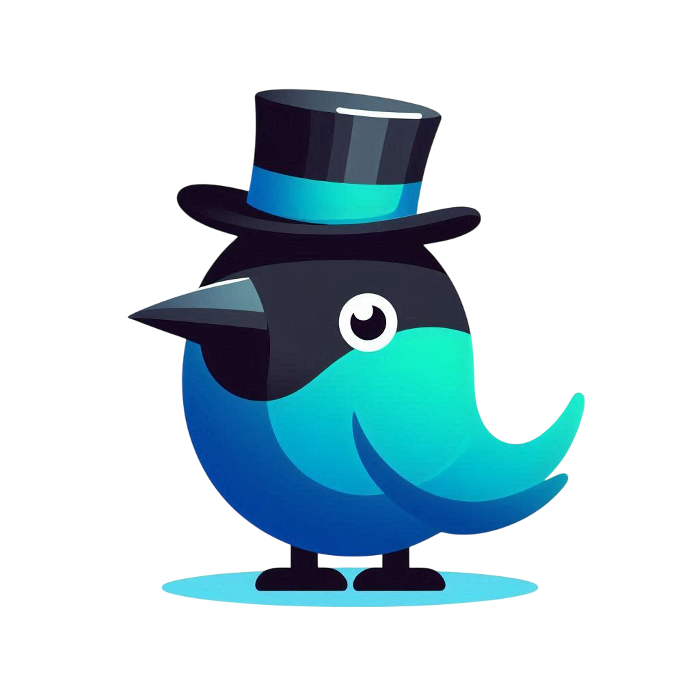

<p align="center">
  <a href="#"></a>
  <br/>
  <font size="4"><b>AzureJay</b></font>
  <br/>
  <em>An AI tutor to help you sound more natural when speaking English</em>
  <br/><br/>
  
  
  
  
  
  
</p>
<hr/>

## About

AzureJay is an AI tutor that helps users practice and speak English. The idea came to me right around the DuolingoMAX launch in Brazil. At the time, their feature felt a bit overpriced and superficial, so I wanted to build my own version. The companion app was built using React Native.

I originally developed this as my undergrad thesis for the B.Sc. in Computer Science at São Paulo State University. The architecture is inspired by the [**OAgents** paper](https://arxiv.org/abs/2506.15741) and the [**Chain-of-Agents (CoA)** paradigm](https://arxiv.org/abs/2508.13167).

<details open="open">
  <summary><b>Contents</b></summary>

- [About](#about)
- [API](#api)
- [Tech Stack](#tech-stack)
- [Getting Started](#getting-started)
- [License](#license)

</details>

## API

All endpoints except register and login require a bearer token.

| Method | Path | Purpose |
| ------ | ---- | ------- |
| POST   | `/auth/` | Register |
| POST   | `/auth/token` | Login |
| GET    | `/users/me` | Current user |
| GET    | `/users/me/profile` | Learning profile |
| PUT    | `/users/change-password` | Change password |
| GET    | `/conversations/` | List conversations |
| POST   | `/conversations/` | Start a conversation |
| GET    | `/conversations/{id}` | Full history with corrections |
| POST   | `/conversations/{id}/chat` | Continue a conversation |
| DELETE | `/conversations/{id}` | Delete a conversation |
| POST   | `/audio/new` | Start a conversation from voice |
| POST   | `/audio/chat/{id}` | Continue a conversation from voice |
| GET    | `/health` | Health check |

## Tech Stack

| Category | Technology |
| --- | --- |
| **Language** | Rust |
| **HTTP framework** | axum + tokio |
| **Database access** | SQLx |
| **Cache / memory** | Redis |
| **LLM orchestration** | Rig |
| **LLM / STT** | Groq (`qwen/qwen3-32b`, Whisper) |
| **TTS** | ElevenLabs |
| **Web search** | Tavily |
| **Grammar analysis** | LanguageTool |
| **Auth** | `jsonwebtoken`, `Argon2` |
| **Language detection** | `whatlang` |
| **Containerization** | Docker & Docker Compose |

## Getting Started

### Local Development

```bash
cp .env.example .env
docker compose up -d db redis
cargo run
```

### With Docker
```bash
docker-compose up --build
```